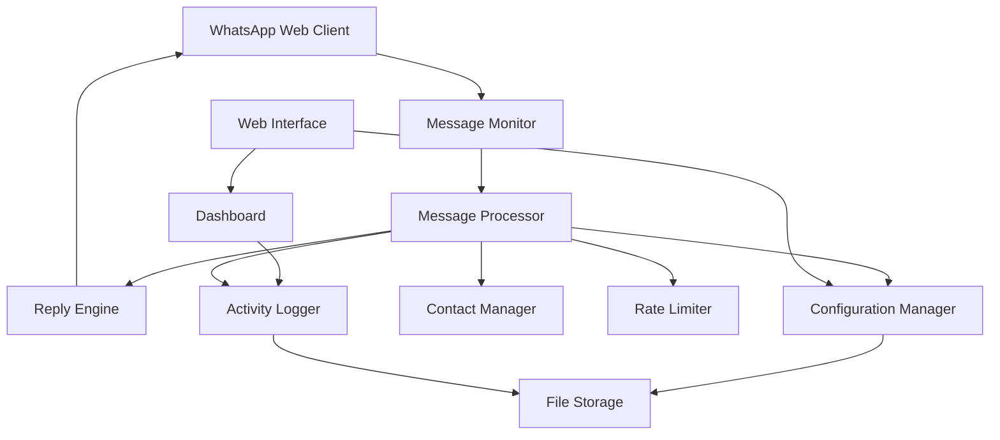

# Design Document

## Overview

The WhatsApp Auto-Reply system will be built as a Node.js application that integrates with WhatsApp Web using the whatsapp-web.js library. This approach provides reliable message monitoring and sending capabilities without requiring official WhatsApp Business API access. The system will feature a web-based configuration interface and persistent storage for settings and logs.

## Architecture

The system follows a modular architecture with clear separation of concerns:



### Core Components:
- **WhatsApp Client**: Manages connection to WhatsApp Web
- **Message Monitor**: Listens for incoming messages
- **Message Processor**: Analyzes messages and determines responses
- **Reply Engine**: Sends automated replies
- **Configuration Manager**: Handles user settings and message templates
- **Rate Limiter**: Prevents spam and manages reply frequency
- **Web Interface**: Provides user configuration and monitoring
- **Activity Logger**: Records all system activities

## Components and Interfaces

### WhatsApp Client Interface
```javascript
interface WhatsAppClient {
  initialize(): Promise<void>
  onMessage(callback: (message: Message) => void): void
  sendMessage(chatId: string, text: string): Promise<void>
  getContacts(): Promise<Contact[]>
  isReady(): boolean
}
```

### Message Processing Interface
```javascript
interface MessageProcessor {
  shouldReply(message: Message): boolean
  generateReply(message: Message, template: MessageTemplate): string
  processIncomingMessage(message: Message): Promise<void>
}
```

### Configuration Interface
```javascript
interface ConfigurationManager {
  getMessageTemplates(): MessageTemplate[]
  updateMessageTemplate(template: MessageTemplate): void
  getSettings(): SystemSettings
  updateSettings(settings: SystemSettings): void
  isBlacklisted(contact: string): boolean
}
```

### Rate Limiting Interface
```javascript
interface RateLimiter {
  canSendReply(chatId: string): boolean
  recordReply(chatId: string): void
  resetLimits(): void
}
```

## Data Models

### Message Template
```javascript
interface MessageTemplate {
  id: string
  name: string
  content: string
  isDefault: boolean
  timeBasedRules?: TimeRule[]
  placeholders: string[] // e.g., ['{name}', '{time}']
}
```

### System Settings
```javascript
interface SystemSettings {
  enabled: boolean
  pauseWhenActive: boolean
  businessHours: {
    start: string // "09:00"
    end: string   // "17:00"
    days: number[] // [1,2,3,4,5] for Mon-Fri
  }
  rateLimitMinutes: number // default 30
  blacklistedContacts: string[]
}
```

### Activity Log Entry
```javascript
interface ActivityLogEntry {
  timestamp: Date
  type: 'message_received' | 'reply_sent' | 'error' | 'system_event'
  chatId: string
  contactName?: string
  messageContent?: string
  replyContent?: string
  error?: string
}
```

### Contact Information
```javascript
interface Contact {
  id: string
  name: string
  number: string
  isBlacklisted: boolean
}
```

## Error Handling

### Connection Management
- Implement automatic reconnection with exponential backoff
- Monitor WhatsApp Web session status
- Handle QR code regeneration for authentication
- Graceful degradation when WhatsApp Web is unavailable

### Message Processing Errors
- Continue processing other messages if one fails
- Log all errors with context for debugging
- Implement retry mechanism for failed message sends
- Validate message content before sending

### Configuration Errors
- Validate all user inputs before saving
- Provide clear error messages for invalid configurations
- Maintain backup of working configurations
- Handle corrupted configuration files gracefully

### Rate Limiting Failures
- Implement circuit breaker pattern for repeated failures
- Monitor and alert on unusual message volumes
- Provide manual override for emergency situations

## Testing Strategy

### Unit Testing
- Test message processing logic with various message types
- Validate template rendering with different placeholders
- Test rate limiting algorithms with edge cases
- Mock WhatsApp client for isolated testing

### Integration Testing
- Test WhatsApp Web integration with test account
- Validate end-to-end message flow
- Test configuration persistence and retrieval
- Verify web interface functionality

### Performance Testing
- Test system performance with high message volumes
- Validate memory usage over extended periods
- Test concurrent message processing
- Monitor response times for auto-replies

### Security Testing
- Validate input sanitization for message templates
- Test authentication mechanisms for web interface
- Verify secure storage of sensitive configuration data
- Test protection against message injection attacks

## Implementation Considerations

### WhatsApp Web Integration
- Use whatsapp-web.js library for reliable WhatsApp Web access
- Handle session management and authentication flows
- Implement proper cleanup on application shutdown
- Monitor for WhatsApp Web updates that might break functionality

### Storage Strategy
- Use JSON files for configuration (simple deployment)
- Implement file locking for concurrent access protection
- Regular backup of configuration and logs
- Log rotation to prevent disk space issues

### Web Interface
- Simple HTML/CSS/JavaScript interface
- Real-time updates using WebSocket or Server-Sent Events
- Mobile-responsive design for configuration on phone
- Export/import functionality for configuration backup

### Deployment
- Single executable with embedded web server
- Configuration through environment variables
- Docker container support for easy deployment
- Systemd service file for Linux systems